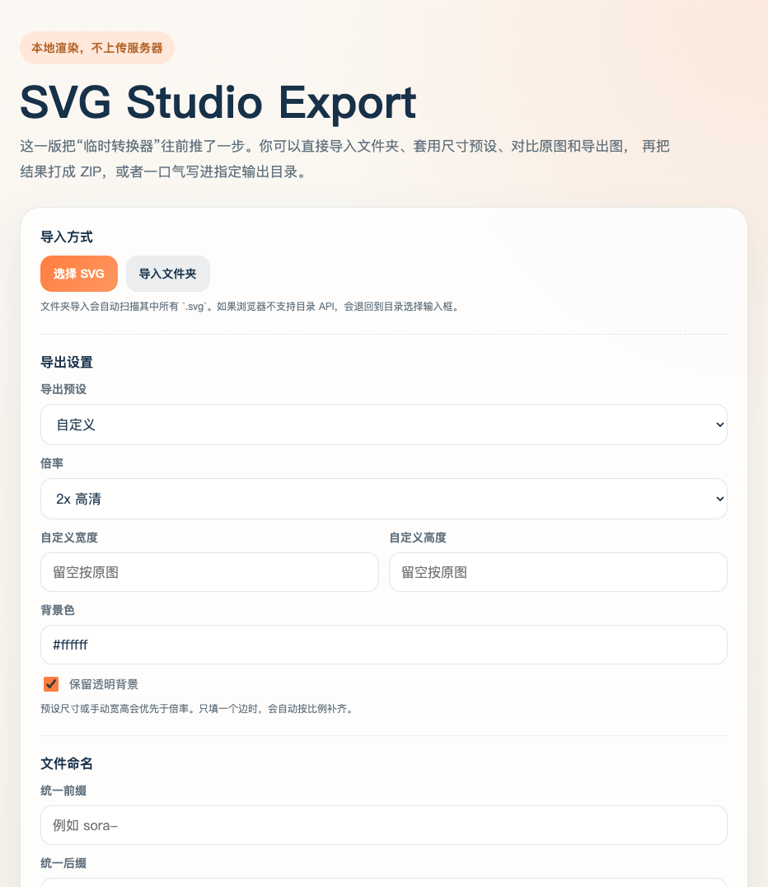

# SVG Studio Export

[中文说明](./README.zh-CN.md) | English

[](https://xujiantong.github.io/svg-studio-export/)
[](https://github.com/xujiantong/svg-studio-export/actions/workflows/deploy-pages.yml)
[](./LICENSE)
[](https://github.com/xujiantong/svg-studio-export/stargazers)
[](https://github.com/xujiantong/svg-studio-export/commits/main)
[](./index.html)

Local-first SVG to PNG export for designers and frontend engineers.

Instead of relying on lossy system converters, SVG Studio Export uses the browser's native SVG rendering path and exports PNG from `Image + Canvas`, which is usually much closer to what you actually see in Chromium.

## Preview



## What It Does

- Import individual SVG files or an entire folder.
- Batch convert SVG to PNG with browser-native rendering.
- Compare original SVG and exported PNG side by side.
- Apply export presets such as WeChat cover, inline article image, and 16:9 output.
- Rename outputs with prefix, suffix, numeric sequence, and conflict-safe file names.
- Download all generated PNG files as a ZIP.
- Save generated PNG files directly into a chosen output directory in supported browsers.
- Mark previously exported files as stale when export settings change.

## Why This Exists

If you have ever converted SVG with `sips`, Quick Look, or a generic backend library, you have probably seen at least one of these:

- Chinese text fallback changing the layout
- font rendering drifting away from the browser version
- wrong canvas size from incomplete `width`, `height`, or `viewBox` handling
- exported preview looking different from the actual SVG opened in Chrome

This project is built for the common case where you want a practical, local, browser-based export tool that stays visually close to the original SVG.

## Features

### Local-first conversion

- Files stay on your machine.
- No upload step.
- Works as a static HTML tool.

### Batch workflow

- Import a folder and scan nested `.svg` files.
- Convert all files in one pass.
- Export ZIP archives for handoff.

### Naming rules

- Add a shared prefix.
- Add a shared suffix.
- Add padded sequence numbers.
- Automatically resolve duplicate output names.

### Visual review

- See the original SVG and exported PNG together.
- Quickly spot font fallback, spacing drift, or scale issues.

### Output presets

- WeChat cover `900 × 383`
- Inline article image `1080 × 608`
- 16:9 `1200 × 675`
- Full HD `1920 × 1080`

## GitHub Pages

This repository includes a GitHub Pages workflow at [`.github/workflows/deploy-pages.yml`](./.github/workflows/deploy-pages.yml).

If Pages is not already active for the repository, make sure the repository setting is:

- `Settings` -> `Pages` -> `Build and deployment` -> `Source` -> `GitHub Actions`

The live URL is expected to be:

- [https://xujiantong.github.io/svg-studio-export/](https://xujiantong.github.io/svg-studio-export/)

## Quick Start

Clone the repo and open the tool locally:

```bash
git clone git@github.com:xujiantong/svg-studio-export.git
cd svg-studio-export
python3 -m http.server 8765 --bind 127.0.0.1
```

Then open:

```text
http://127.0.0.1:8765/
```

## Browser Support

- Best experience: Chromium-based browsers
- Folder import: works in modern Chromium browsers, with fallback to `webkitdirectory`
- Write to directory: requires the File System Access API

## Project Structure

```text
.
├── .github/workflows/deploy-pages.yml
├── assets/preview.png
├── index.html
├── LICENSE
├── README.md
└── README.zh-CN.md
```

## Roadmap

- Export WebP and JPG alongside PNG
- Add drag-sort for export order
- Add font dependency diagnostics
- Add a desktop build with Electron or Tauri
- Add watch mode for auto conversion from a folder

## Star History

[](https://star-history.com/#xujiantong/svg-studio-export&Date)

## Credits

- Badges powered by [Shields.io](https://shields.io/)
- Star chart powered by [Star History](https://star-history.com/)

## License

[MIT](./LICENSE)
